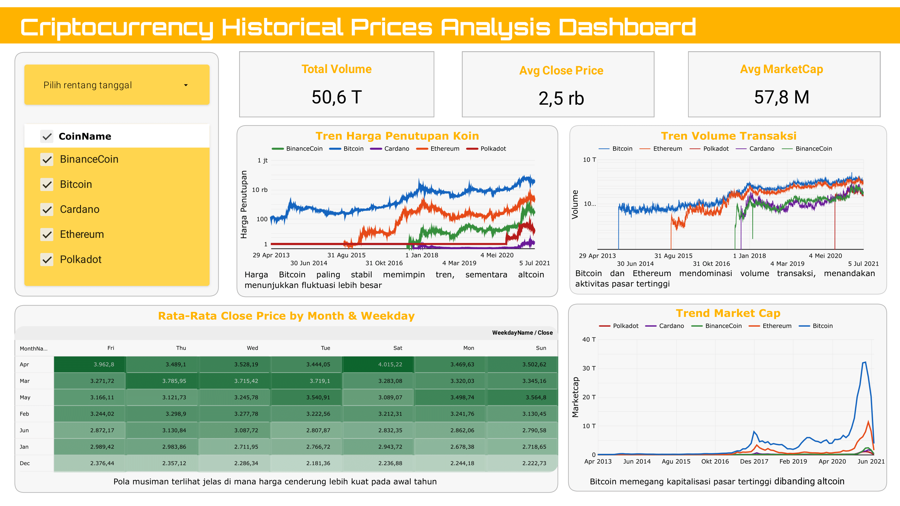

# Crypto Historical Prices Dashboard

**Data Analytics • Cryptocurrency Market Insights • Looker Studio Dashboard**

<p align="center">
  
</p>

This project analyzes eight years of historical data across five major cryptocurrencies to uncover price dynamics, volatility patterns, market behavior, and seasonal trends. It is built as an end-to-end analytics workflow—from data preparation and exploration to visualization and strategic recommendations to support more informed and data-driven investment decisions.

---

## **1. Background**

The cryptocurrency market is characterized by extreme volatility, making it difficult for investors to identify safe momentum and optimal allocation strategies. Differences in asset stability, unpredictable trading windows, and sharp fluctuations in volume introduce additional risk especially for retail investors sensitive to liquidity swings.
This project addresses that challenge by leveraging long-term historical data to extract reliable insights that can guide more measured and informed investment decision-making.

---

## **2. Analytical Workflow**

### **1. Business Understanding**

Defined investor needs:

* More accurate trading timing
* Identifying long-term stable assets
* Improving confidence in portfolio allocation

### **2. Data Collection**

8 years of historical data across 5 major cryptocurrencies.

### **3. Data Preparation**

Performed rigorous cleaning:

* Type normalization
* Missing value handling
* Duplicate removal
* Outlier review
* Cleaned CSV export

### **4. Exploratory Data Analysis**

Identified trends, seasonal movement, volatility patterns, and volume shifts.

### **5. Dashboard Development**

Built an interactive **Looker Studio dashboard** to deliver fast, insight driven decision support.

---

## **3. Key Findings**

* **Bitcoin leads market movements** and remains the most stable asset.
* **Trading volume is dominated by Bitcoin and Ethereum**, signaling market trust.
* **Bitcoin’s market cap** far outpaces all others.
* Strong **seasonal patterns**:

  * Price increases early in the year
  * Weekends show upward tendencies

---

## **4. Strategic Recommendations**

* **Bitcoin as anchor asset** due to its strong signaling effect.
* **Ethereum & BNB** as stable growth drivers.
* Use **early-year & weekend seasonality** for timing optimization.
* **ADA & DOT** as small high-risk tactical positions with tight risk management.

---

## **5. Tools & Technologies**

* Python (Pandas, NumPy, Matplotlib)
* Jupyter Notebook
* Google Sheets
* Looker Studio
* Git & GitHub

---

## **6. Project Structure**

```
 crypto-historical-prices-dashboard
├── data/
│   ├── raw/                  # Original csv data
│   ├── cleaned/              # Final cleaned datasets
├── notebooks/                # Jupyter Notebooks
├── deliverables/
│   ├── dashboard/            # Dashboard preview images
│   ├── report/               # Project documentation
└── README.md
```

---

##  **Team**

Nicki D. Utomo, Anindya Meyla KS, Yusi Nifmad Maulida, Rafli Firdaus Muzaki, Muhammad Arifian

A collaborative team delivering clean analytics, financial insights, and clear dashboard visualizations designed for strategic, data-driven decision-making.
